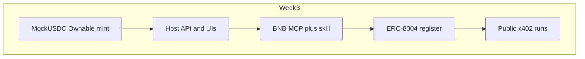

# Week 3 — BNB MCP, ERC-8004, x402, contract harden, deploy

**Status:** planning reference for execution (do not treat this file as “done” until tracks below are checked off).  
**Out of scope:** PWA, WalletConnect, native apps, mainnet, full ERC-8183 escrow.

**North star:** Hosted cooker + merchant on HTTPS; MockUSDC mint owner-only on BSC Testnet 97; CommerceAgent registered (ERC-8004); public agent runs payable via x402; Cursor can use BNB MCP/skill. SIWE in-app paths stay free and green.

**Suggested build order:** 1 contract → 2 deploy → 3 MCP/skill → 4 ERC-8004 → 5 x402.

---

## Track A — Smart contract security

`[contracts/MockUSDC.sol](./contracts/MockUSDC.sol)` now inherits **OpenZeppelin v5.7.0** `ERC20` + `Ownable` + `Pausable`. `mint` / `burn` / `pause` are **owner-only**. Pay still uses `transfer`. **Redeploy on chain 97 is still required** — an old open-mint address does not pick up this code.

### Changes

1. OpenZeppelin Ownable + Pausable (Remix GitHub import, not inlined).
2. `mint(to, amount)` — `onlyOwner` + not paused.
3. Owner-only `burn` for cleanup (not used by cooker pay; no dollar reserves).
4. Keep **6 decimals**, name/symbol Mock USDC / mUSDC so cooker pay path unchanged.
5. Pin Solidity **0.8.37**.
6. Redeploy on **BSC Testnet 97** via Remix; set `MOCK_USDC_ADDRESS` / `VITE_MOCK_USDC_ADDRESS` in local `.env` (`.env.example` stays blank).
7. Docs: `[contracts/README.md](./contracts/README.md)` + `[INSTRUCTIONS.md](./INSTRUCTIONS.md)` — mint only from owner wallet; never mainnet.

### Exit

- [x] New address live
- [x] Owner can mint cooker/merchant test balances
- [x] Non-owner mint reverts
- [x] Pay → verify → fulfill still works

---

## Track B — Deployment

Defaults: **Railway/Fly for** `backend`, **Vercel for** `cooker-ui` **+** `merchant-ui`.

1. Backend: Node 22, `npm start` / build, env from `[.env.example](./.env.example)`.
2. API listens on `0.0.0.0` / `PORT`.
3. CORS: `COOKER_URL` + `MERCHANT_URL` = production HTTPS origins (`[backend/src/config.ts](./backend/src/config.ts)` `uiOrigins()`).
4. Cookie `Secure` when UIs are HTTPS (`cookieSecure()`).
5. Vite apps: `VITE_API_URL`, `VITE_MOCK_USDC_ADDRESS`, `VITE_CHAIN_ID`, RPC.
6. Smoke after deploy: health → SIWE cooker → run → quote → pay → merchant fulfill.

### Exit

- [x] Two public UI URLs + API `/health`
- [x] External tryout possible without laptop localhost

See also `[TRYOUT.md](./TRYOUT.md)` (write during this track).

---

## Track C — BNB MCP + skill (Cursor)

1. Add Cursor MCP config for `@bnb-chain/mcp` — see [BNB MCP docs](https://docs.bnbchain.org/developer-kit/mcp/) and `[docs/BNB-MCP.md](./docs/BNB-MCP.md)`.
2. Install / enable **[bnbchain-skills](https://github.com/bnb-chain/bnbchain-skills)** (`npx skills add bnb-chain/bnbchain-skills`).
3. Smoke: from Cursor, `register_erc8004_agent` / `get_erc8004_agent` on `bsc-testnet` (never default to mainnet).

### Exit

- [ ] MCP connected in Cursor
- [ ] Skill usable
- [ ] Ops can register/inspect without leaving Cursor

---

## Track D — ERC-8004

1. Host agent metadata JSON (name, description, image, `services` with public API URL) — see `[docs/agent-metadata.example.json](./docs/agent-metadata.example.json)`.
2. Serve live: `GET https://botlevy-commerce-production.up.railway.app/agent/metadata.json`.
3. Register **Botlevy CommerceAgent** on BSC Testnet via MCP `register_erc8004_agent` (`network: bsc-testnet`).
4. Store in env + README:
  - `ERC8004_AGENT_ID`
  - `ERC8004_AGENT_URI`
  - `ERC8004_TX_HASH`
5. Check [https://testnet.8004scan.io/](https://testnet.8004scan.io/)
6. Document: SIWE app users do **not** need 8004; identity is for **public/discoverable** integrator surface (x402 Track E).

### Exit

- [x] Metadata hosted on Railway API (`GET /agent/metadata.json`)
- [x] Agent visible on testnet registry / 8004scan (agentId **2464**)
- [x] Docs point to metadata URI + integrator vs SIWE---

## Track E — x402 public runs

Keep existing SIWE `[POST /agent/runs](./backend/src/routes/agent.ts)` **unchanged** (free for cooker UI).

1. Add `POST /agent/public/runs` with same body shape as cooker runs where practical.
2. Gate with x402 (challenge → pay → retry with proof). Prefer official `@x402/*` if BSC-testnet friendly; otherwise minimal verify against `X402_PAYTO` + `X402_PRICE` (MockUSDC atomic units on chain 97).
3. On success, same orchestrator / dish-flow; return `runId`, `status`, `steps`, deliverable (no cooker session cookies).
4. Harder rate-limit on public route.
5. Document in `[docs/X402.md](./docs/X402.md)` + link from TRYOUT.

### Exit

- [ ] Unauthenticated caller unpaid → **402**
- [ ] Valid payment proof → run JSON
- [ ] SIWE `/agent/runs` still free

---

## Day-ish checklist (~14h @ 2h/day)

| Block | Focus                                                 |
| ----- | ----------------------------------------------------- |
| 1–2   | MockUSDC Ownable+Pausable, Remix redeploy, env + docs |
| 3–4   | Host backend + both UIs, CORS/cookies, smoke pay loop |
| 5     | TRYOUT.md + faucet/mint owner path                    |
| 6     | BNB MCP + skill + docs/BNB-MCP.md                     |
| 7     | ERC-8004 register + record ids                        |
| 8+    | x402 public runs + docs; freeze                       |

---

## Verification

- [ ] Non-owner `mint` reverts; owner mint works
- [ ] Hosted cooker: chat → cek harga → pay → merchant fulfill
- [ ] MCP register/read works once on `bsc-testnet`
- [ ] `POST /agent/public/runs` without pay → 402; with valid x402 → run JSON
- [ ] `POST /agent/runs` with SIWE still works without x402

---

## Related docs (to create/update during execution)

| File                                                                     | Purpose                      |
| ------------------------------------------------------------------------ | ---------------------------- |
| `[WEEK3.md](./WEEK3.md)`                                                 | This plan                    |
| `[TRYOUT.md](./TRYOUT.md)`                                               | Hosted tryout guide          |
| `[docs/BNB-MCP.md](./docs/BNB-MCP.md)`                                   | Cursor MCP + skill setup     |
| `[docs/X402.md](./docs/X402.md)`                                         | Public paid runs             |
| `[docs/agent-metadata.example.json](./docs/agent-metadata.example.json)` | ERC-8004 agentURI payload    |
| `[contracts/README.md](./contracts/README.md)`                           | Remix deploy + owner mint    |
| `[DEPLOY.md](./DEPLOY.md)`                                               | Railway/Vercel env checklist |

